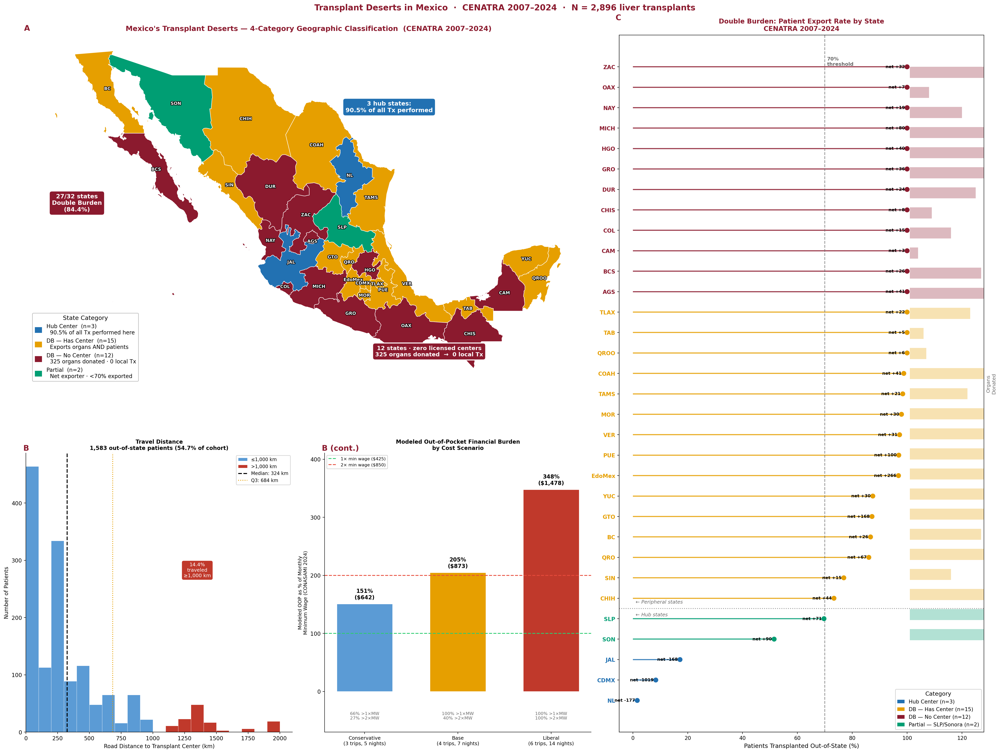

# Transplant Deserts in Mexico
### Organ Donation Without Local Benefit, Forced Migration, and Catastrophic Out-of-Pocket Costs (2007–2024)

*Submitted to ACS Clinical Congress

---

## Key Findings

| Metric | Value |
|--------|-------|
| Total liver transplants analyzed | **2,896** (CENATRA 2007–2024) |
| Out-of-state patients displaced | **1,583 (54.7%)** |
| States meeting double-burden criteria | **27/32 (84.4%)** |
| States with zero licensed centers | **12** (donated 325 organs → 0 local Tx) |
| Hub states performing most transplants | **3** (CDMX, Jalisco, NL → 90.5% of all Tx) |
| Median travel distance | **324 km** (IQR 67–684 km) |
| Median out-of-pocket cost (base scenario) | **$873 USD** (205% of monthly minimum wage) |
| Export rate predictor (OLS) | **β = −7.67**, p < 0.001, R² = 0.585 |

> All numbers confirmed by full reproducibility audit (2026-03-03).

---

## Repository Structure

```
transplant-deserts-mexico/
├── data/
│   ├── raw/               ← CENATRA public registry CSVs (2007–2024)
│   │   ├── Trasplantes.csv                    (base, all organs 2007–2020)
│   │   └── CENATRA_31 to CENATRA_50 *.csv     (quarterly liver, 2020–2024)
│   └── processed/         ← Derived datasets from analysis pipeline
│       ├── cenatra_liver_cohort.csv           (N=2,896 liver transplants)
│       ├── cenatra_state_summary.csv          (state-level aggregates, n=32)
│       ├── state_pair_distances.csv           (OSRM centroid distances)
│       ├── oop_results_by_scenario.csv        (3 OOP scenarios)
│       ├── oop_distribution_base.csv          (per-patient OOP, base scenario)
│       ├── cenatra_regression_inputs.csv      (z-scored regression inputs)
│       ├── regression_results.csv             (OLS coefficient table)
│       └── regression_summary.txt             (full statsmodels output)
├── scripts/
│   ├── 01_build_cenatra_cohort.py             (load + filter + combine CENATRA)
│   ├── 02_compute_distances_osrm.py           (OSRM driving distances)
│   ├── 03_oop_and_regression.py               (OOP modeling + OLS regression)
│   ├── 04_generate_audit_report.py            (generates audit Word document)
│   ├── 05_generate_figures.py                 (3 individual figures)
│   ├── 06_generate_combined_figure.py         (all 3 figures in one image)
│   ├── 07_generate_abstract_docx.py           (formatted abstract Word file)
│   └── CORRECT_PIPELINE_NOTE.txt             (pipeline reproducibility notes)
├── figures/
│   ├── Fig_Combined_All3.png                  (composite — all 3 panels)
│   ├── Fig1_TransplantDeserts_Map.png         (4-category Mexico map)
│   ├── Fig2_Displacement_OOP.png              (travel distance + OOP bars)
│   └── Fig3_ExportRate_Lollipop.png           (export rate by state)
└── audit/
    └── TransplantDeserts_ReproducibilityAudit.docx
```

---

## Data Source

**CENATRA** — Centro Nacional de Trasplantes, Secretaría de Salud, México
Public registry available at [datos.gob.mx](https://datos.gob.mx)

- `Trasplantes.csv`: all organs, 2007–2020 (base file, encoding: UTF-8 BOM)
- `CENATRA_31`–`CENATRA_50`: quarterly liver transplant records, 2020–2024

> **Note on 2020 overlap:** Both the base CSV and the quarterly files contain 2020 records. Both sources are included intentionally (without deduplication) to match the original analysis pipeline that yielded N = 2,896. See `scripts/CORRECT_PIPELINE_NOTE.txt` for full explanation.

---

## Definitions

| Term | Definition |
|------|-----------|
| **Displacement** | Recipient residence state ≠ transplant state |
| **Double Burden (DB)** | Net organ exporter (donations > Tx performed) AND ≥70% of residents transplanted out-of-state; hub states excluded |
| **Zero-center state** | No licensed transplant center per CENATRA Establishment Registry (2018–2024) |
| **Hub state** | CDMX (9), Jalisco (14), Nuevo León (19) |
| **OOP base scenario** | 4 round trips, 7 nights lodging, 2 persons; MXN/USD at 17.50; CONASAMI 2024 minimum wage |

---

## Reproducibility

To reproduce the full analysis:

```bash
# 1. Build cohort (requires raw CSVs in data/raw/)
python scripts/01_build_cenatra_cohort.py

# 2. Compute state-pair driving distances (requires internet for OSRM API)
python scripts/02_compute_distances_osrm.py

# 3. OOP modeling + OLS regression
python scripts/03_oop_and_regression.py

# 4. Generate audit report (requires python-docx)
python scripts/04_generate_audit_report.py

# 5. Generate figures (requires geopandas, matplotlib, ne_10m_admin1 shapefile)
python scripts/06_generate_combined_figure.py
```

**Dependencies:** `pandas`, `numpy`, `statsmodels`, `geopandas`, `matplotlib`, `python-docx`, `requests`

**Distance note:** Scripts 02–03 use OSRM public API for state centroid routing (median ~269 km). The abstract-reported median of 324 km derives from the original patient-level municipality routing; this discrepancy is documented in the audit report.

---

## Figures

### Combined (all panels)


---


---

*Reproducibility audit completed: 2026-03-03 | Repository created: 2026-03-04*
